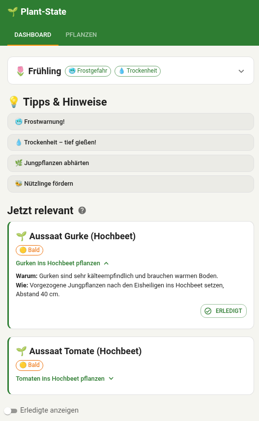
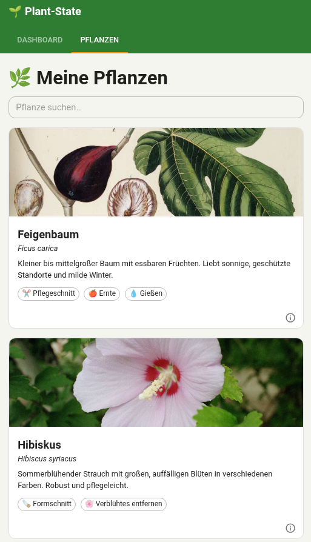
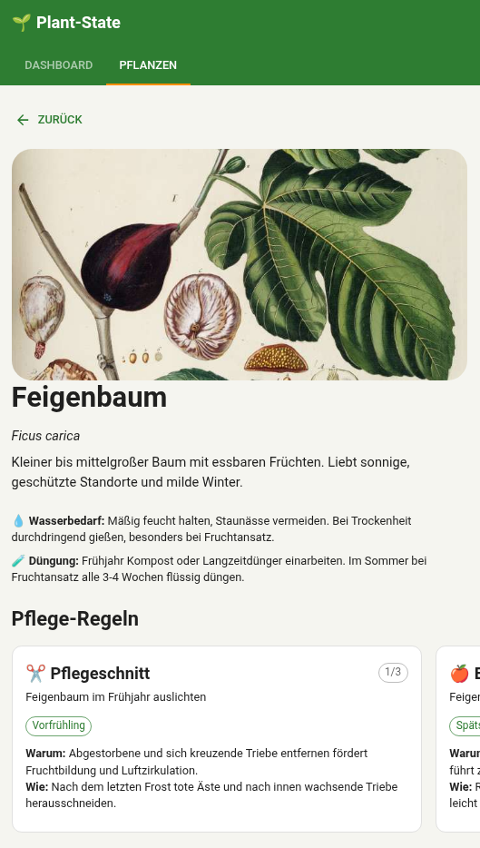
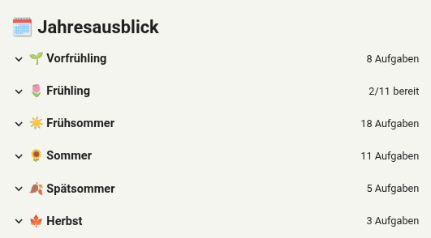
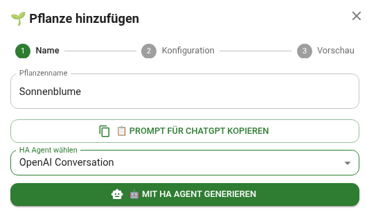
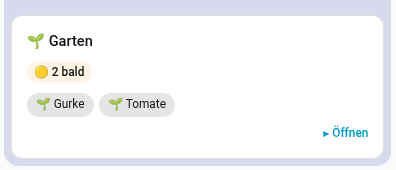

# 🌱 Plant-State — Garden Lifecycle Manager

[](https://github.com/temporaer/plantstate/actions/workflows/addon-build.yml)
[](LICENSE)
[](https://github.com/temporaer/plantstate/pkgs/container/plantstate-addon-amd64)
[](https://python.org)
[](https://nodejs.org)
[](https://docs.sigstore.dev)
[](https://en.wikipedia.org/wiki/Vibe_coding)

A weather-driven garden task planner that runs as a Home Assistant add-on or standalone via Docker Compose.

> **🤖 Vibe-coded** — Built with extensive AI assistance (GitHub Copilot). Tested (96+ unit tests), scanned (Trivy), and signed (cosign) — but treat it accordingly.

<p align="center">
  
  &nbsp;&nbsp;
  
  &nbsp;&nbsp;
  
</p>
<p align="center">
  
  &nbsp;
  
  &nbsp;
  
</p>

## Features

- **30 plants** with lifecycle rules (pruning, harvesting, sowing, watering, fertilizing, etc.)
- **Weather-based activation** — tasks become relevant based on DWD forecast + history
- **Per-plant thresholds** — e.g. drought-sensitive plants trigger water tasks earlier
- **Priority & urgency** — smart sorting (acute → soon → relaxed, high → normal → low)
- **Calendar sync** — pushes relevant tasks to a Home Assistant calendar
- **Collapsible dashboard** — weather card, tips, completed tasks toggle
- **Swipeable rule cards** on mobile, stacked on desktop
- **LLM-generated plant profiles** — structured JSON validated against strict Pydantic contract
- **Regeneration** — update plant rules via API, LLM agent, or direct JSON

## Architecture

```
backend/    Python (FastAPI, SQLAlchemy, Pydantic, APScheduler)
frontend/   TypeScript (React, Vite, MUI, TanStack Query)
ha-addon/   Home Assistant add-on packaging
```

Domain logic is independent of Home Assistant.
HA is only used as a weather data source and calendar sync target.

### Weather Events

Tasks activate based on deterministic weather events computed from forecast + history:

| Event | Condition |
|---|---|
| `frost_risk_active` | min(next 5 days T_min) ≤ 1°C |
| `frost_risk_passed` | min(last 7 days T_min) > 1°C AND min(next 5 days T_min) > 1°C |
| `sustained_mild_nights` | ≥ 4 of next 5 nights T_min ≥ 8°C |
| `warm_spell` | ≥ 3 of next 5 days T_max ≥ 20°C |
| `heatwave` | 3 consecutive days T_max ≥ 30°C |
| `dry_spell` | N consecutive days < 1mm rain AND < 5mm in last 7 days (N = per-plant threshold, default 5) |
| `persistent_rain` | 3 consecutive days ≥ 5mm rain |

## Deployment

### Option A: Home Assistant Add-on

1. Add this repository to HA: **Settings → Add-ons → Repositories → Add** `https://github.com/temporaer/plantstate`
2. Install "Plant-State" and start it
3. Configure via the add-on settings (HA token, weather entity, calendar entity)

### Option B: Docker Compose (standalone)

```bash
git clone https://github.com/temporaer/plantstate.git
cd plantstate

# Create .env
cat > .env <<EOF
HA_BASE_URL=https://your-ha-instance.local:8123
HA_TOKEN=your_long_lived_access_token
HA_WEATHER_ENTITY=weather.karlsruhe
HA_CALENDAR_ENTITY=calendar.garden
EOF

docker compose up -d --build
```

- **UI**: `http://<host>:3000`
- **API docs**: `http://<host>:8000/docs`

## API

| Method | Endpoint | Description |
|---|---|---|
| `GET` | `/plants` | List all plants |
| `GET` | `/plants/{id}` | Get plant detail |
| `POST` | `/plants` | Create plant from LLM JSON |
| `PUT` | `/plants/{id}/update-json` | Update plant with raw JSON (preserves completed tasks + image) |
| `POST` | `/plants/interpret` | LLM interpretation |
| `POST` | `/plants/generate` | Generate via HA agent |
| `POST` | `/plants/regenerate-all` | Regenerate all plants via HA agent |
| `GET` | `/dashboard/relevant-now-live` | Current tasks (fetches weather from HA) |
| `GET` | `/dashboard/completed` | Completed/skipped tasks this year |
| `GET` | `/dashboard/outlook` | Yearly task outlook |
| `GET` | `/dashboard/weather` | Current weather + events |
| `GET` | `/dashboard/tips` | Contextual gardening tips |
| `POST` | `/tasks/{id}/complete` | Mark task done |
| `POST` | `/tasks/{id}/skip` | Skip task |
| `POST` | `/tasks/{id}/snooze` | Snooze task (default 14 days) |
| `POST` | `/sync/calendar` | Sync tasks to HA calendar |

## Home Assistant Integration

### Calendar Entity

Create a local calendar in HA:

1. **Settings → Devices & Services → Add Integration → Local Calendar**
2. Name it `garden` (entity: `calendar.garden`)

Tasks sync automatically every 6 hours, or manually via `POST /api/sync/calendar`.

### Authentication

**Add-on mode**: No configuration needed — the Supervisor token is injected automatically.

**Standalone mode**: Create a long-lived access token in HA (Profile → Long-Lived Access Tokens) and set it as `HA_TOKEN` in `.env`.

## Development

### Prerequisites

- [Miniforge/Mamba](https://github.com/conda-forge/miniforge)

```bash
mamba env create -f environment.yml
conda activate plant-state
```

### Run locally

```bash
# Backend
uvicorn backend.api.routes:app --reload --port 8000

# Frontend
cd frontend && npm install && npm run dev
```

### Tests

```bash
python -m pytest backend/tests/ -q
```

96 tests covering event computation, rule evaluation, lifecycle activation, API integration, and E2E flows. Tests run without Home Assistant.
